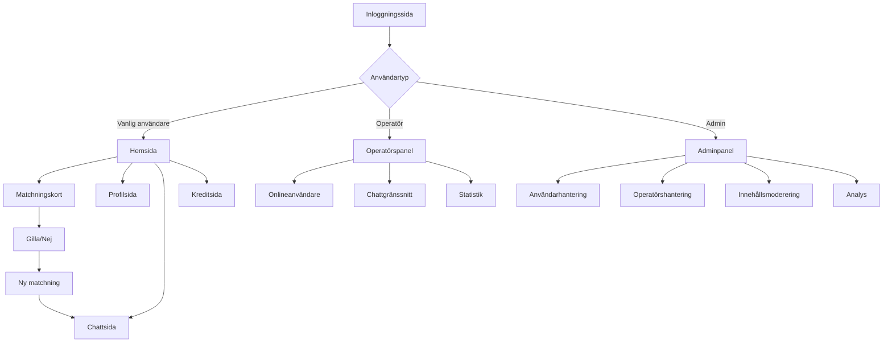

## 1. Produktöversikt

En multi-domän dejtingplattform med tre separata applikationer som möjliggör användarregistrering, matchning, chatt och administration. Plattformen riktar sig till singlar som söfter kontakt och administratörer som hanterar systemet.

Problemet som löses: Traditionella dejtingsajter har begränsade administrationsmöjligheter och saknar dedikerade verktyg för operatörer. Denna plattform erbjuder en komplett lösning med separata gränssnitt för användare, operatörer och administratörer.

Målgrupp: Singlar 18+ år, chattoperatörer och systemadministratörer.

## 2. Kärnfunktioner

### 2.1 Användarroller

| Roll | Registreringsmetod | Kärnbehörigheter |
|------|-------------------|------------------|
| Vanlig användare | E-postregistrering | Skapa profil, söka matchningar, chatta, köpa krediter |
| Chattoperatör | Admin skapar konto | Hantera chattar, se statistik, växla mellan profiler |
| Admin | Systeminstallation | Fullständig kontroll över alla system, skapa operatörer, moderera innehåll |

### 2.2 Funktionsmodul

Vår dejtingplattform består av följande huvudsakliga applikationer:

**1. Dejtingsajt (Huvuddomän):**
1. **Inloggningssida**: Användarautentisering, registrering, återställ lösenord
2. **Hemsida**: Matchningskort, sökfilter, onlinestatus, navigeringsmeny
3. **Profilsida**: Fotoalbum, personlig information, inställningar
4. **Chattsida**: Konversationslista, meddelandehistorik, realtidschatt
5. **Kreditsida**: Köp krediter, transaktionshistorik, prisplaner

**2. Chattoperatörspanel (Separat domän):**
1. **Instrumentpanel**: Onlineanvändare översikt, aktivitetsstatistik
2. **Chattgränssnitt**: Aktiva konversationer, användarinfo, snabbsvar
3. **Statistik**: Användaraktivitet, chattmätningar, prestationsrapporter
4. **Profilväxlare**: Växla mellan olika användarprofiler

**3. Adminpanel (Separat domän):**
1. **Multisite-hantering**: Hantera flera domäner, konfigurationer
2. **Användarhantering**: Lista användare, moderera profiler, blockera konton
3. **Operatörshantering**: Skapa/redigera operatörer, tilldela behörigheter
4. **Innehållsmoderering**: Granska foton, profiltext, rapporterade användare
5. **Analys**: Plattformsstatistik, användartrender, intäktsrapporter

### 2.3 Sidinformation

| Sidnamn | Modulnamn | Funktionsbeskrivning |
|---------|-----------|----------------------|
| Inloggningssida | Inloggningsformulär | Logga in med e-post/lösenord, visa "kom ihåg mig" alternativ |
| Inloggningssida | Registrering | Skapa nytt konto med e-post, lösenord, grundläggande information |
| Inloggningssida | Lösenordsåterställning | Begär lösenordsåterställning via e-post |
| Hemside | Matchningskort | Visa användarprofiler med foto, ålder, plats, onlinestatus |
| Hemside | Swipe-funktioner | Gilla/nekade profiler med svepgester eller knappar |
| Hemside | Sökfilter | Filtrera efter ålder, plats, kön, onlinestatus |
| Hemside | Navigeringsmeny | Vänstersidebar med snabblänkar till profiler, chatt, inställningar |
| Profilsida | Fotoalbum | Ladda upp/redigera profilbilder, sätt huvudfoto |
| Profilsida | Personlig information | Redigera ålder, plats, bio, intressen |
| Profilsida | Kontoinställningar | Ändra lösenord, e-post, notifikationer |
| Chattsida | Konversationslista | Visa alla aktiva konversationer med senaste meddelanden |
| Chattsida | Chattfönster | Skicka/ta emot meddelanden i realtid, se skrivindikatorer |
| Chattsida | Användarinfo | Visa motpartens profilinfo i chatten |
| Kreditsida | Kreditköp | Köp krediter för premiumfunktioner via betalningsgateway |
| Kreditsida | Transaktionshistorik | Visa tidigare köp och kreditförbrukning |
| Operatörspanel | Onlineanvändare | Se lista över onlineanvändare med aktivitetsstatus |
| Operatörspanel | Chattgränssnitt | Hantera flera konversationer samtidigt |
| Operatörspanel | Statistik | Visa antal chattar, svarstider, användaraktivitet |
| Adminpanel | Domänhantering | Konfigurera inställningar för varje domän |
| Adminpanel | Användarlista | Sök, filtrera, redigera användarinformation |
| Adminpanel | FotoModerering | Granska och godkänna/avslå uppladdade foton |
| Adminpanel | Operatörshantering | Lägg till/redigera/ta bort operatörskonton |

## 3. Kärnprocesser

### Vanlig användarflöde:
Användaren börjar på inloggningssidan där de kan logga in eller registrera sig. Efter inloggning kommer de till hemsidan med matchningskort. De kan svepa genom profiler, använda filter för att hitta matchningar, och starta konversationer med användare de gillar. Chattfunktionen kräver krediter för vissa funktioner.

### Operatörsflöde:
Operatörer loggar in via sin dedikerade domän och ser direkt en översikt över onlineanvändare. De kan välja att chatta med användare, växla mellan olika profiler för att ge stöd, och övervaka statistik över sin aktivitet.

### Adminflöde:
Administratörer loggar in i adminpanelen och kan hantera alla aspekter av plattformen. De kan skapa nya operatörer, moderera användargenererat innehåll, konfigurera plattformsinställningar och analysera plattformens prestanda.

## 4. Användargränssnittsdesign

### 4.1 Designstil
- **Primära färger**: Mörk bakgrund (#1a1a1a) med rosa/magenta accenter (#e91e63, #ff4081)
- **Sekundära färger**: Vit text, gråa nyanser för sekundära element
- **Knappstil**: Runda hörn, 3D-effekt vid hovring, rosa bakgrund för primära åtgärder
- **Typsnitt**: Modernt sans-serif, 16px för brödtext, 24px för rubriker
- **Layout**: Kortbaserad design med vänstersidebar för navigation
- **Ikoner**: Material Design-ikoner, emojis för statusindikatorer

### 4.2 Sidöversikt Design

| Sidnamn | Modulnamn | UI-element |
|---------|-----------|------------|
| Inloggningssida | Inloggningskort | Centrerad kort med mörk bakgrund, rosa knappar, rundade hörn |
| Hemsida | Matchningskort | Horisontella kort med användarfoton, ålder/plats i nederkant, like/neka-knappar |
| Hemsida | Sidebar | Mörk bakgrund, ikonbaserad navigation, onlinestatus-indikatorer |
| Profilsida | Fotoalbum | Rutnät med miniatyrbilder, huvudfoto-markerat, uppladdningsknapp |
| Chattsida | Meddelandelista | Bubbelbaserad chatt, tidsstämplar, skrivindikatorer |
| Kreditsida | Priskort | Kort med kreditpaket, köp-knappar, transaktionshistorik-tabell |

### 4.3 Responsivitet
Produkten är mobilförst med adaptiv design för desktop. Touch-interaktion optimerad för mobila enheter. Swipe-funktioner för matchningskort är primärt designade för mobilanvändning.