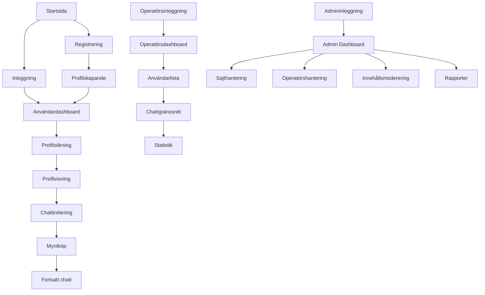

## 1. Produktöversikt

En multi-domin dejtingplattform med tre separata applikationer som möjliggör kommunikation mellan användare och operatörer genom ett betalbaserat chatsystem. Plattformen tillåter administration av flera dejtingsajter samtidigt med fullständig kontroll över innehåll och operatörer.

Problemet som löses: Traditionella dejtingsajter har begränsad kontroll över användarinteraktioner och saknar flexibilitet för operatörsstöd. Denna lösning ger administratörer full kontroll över flera sajter samtidigt medan operatörer kan hjälpa användare genom betald chattjänst.

Målgrupp: Dejtingplattformsägare, chattoperatörer och slutanvändare som söker kontakt.

## 2. Kärnfunktioner

### 2.1 Användarroller

| Roll | Registreringsmetod | Kärnbehörigheter |
|------|-------------------|------------------|
| Användare (Dating Site) | E-postregistrering | Bläddra profiler, skicka betalda meddelanden, köpa mynt |
| Operatör (Chat Panel) | Admin-tilldelad | Gratis chatt med användare, se online-användare, visa statistik |
| Admin (Admin Panel) | Systemägare | Hantera sajter, operatörer, moderera innehåll, godkänna bilder |

### 2.2 Funktionsmoduler

Dejtingplattformens krav består av följande huvudsidor:

**Dating Site (Domän 1):**
1. **Startsida**: Hjältesektion, sajtnavigation, utvalda profiler
2. **Registreringssida**: Användarregistrering, profilskapande
3. **Inloggningssida**: Användarautentisering
4. **Profilsida**: Användarprofil, bildgalleri, grundinformation
5. **Söksida**: Filtrering av profiler, sökresultat
6. **Chatt-sida**: Realtidschatt, myntsaldo, chattlista
7. **Betalningssida**: Köp av mynt, betalningsmetoder
8. **Användarinställningar**: Profilredigering, kontoinställningar

**Chat Operator Panel (Domän 2):**
1. **Operatörsdashboard**: Översikt, statistik, online-användare
2. **Chatt-gränssnitt**: Realtidschatt med användare
3. **Användarlista**: Online/offline status, användarinformation
4. **Statistik-sida**: Chattstatistik, användaraktivitet

**Admin Panel (Domän 3):**
1. **Admin-dashboard**: Multi-sajtöversikt, nyckeltal
2. **Sajthantering**: Skapa/redigera/ta bort dejtingsajter
3. **Operatörshantering**: Lägg till/redigera/ta bort operatörer
4. **Användarhantering**: Granska användare, moderera profiler
5. **Innehållsmoderering**: Bildgodkännande, textgranskning
6. **Rapportcenter**: Användarrapporter, systemrapporter
7. **Systeminställningar**: Globala konfigurationer, betalningsinställningar

### 2.3 Sidinformation

| Sidnamn | Modulnamn | Funktionsbeskrivning |
|---------|------------|---------------------|
| Startsida | Hjältesektion | Visa bakgrundsbild, call-to-action knappar, sajtinformation |
| Startsida | Profilgalleri | Rutnät med användarprofiler, snabbvisning av grundinfo |
| Registrering | Registreringsformulär | E-post, lösenord, kön, ålder, plats, profilbildsuppladdning |
| Inloggning | Inloggningsformulär | E-post/lösenord eller social inloggning |
| Profilsida | Profilinformation | Ålder, plats, intressen, beskrivning, bildgalleri |
| Profilsida | Kontaktfunktioner | Skicka meddelande-knapp, lägg till favoriter |
| Söksida | Sökfilter | Ålder, plats, kön, intressen, online-status |
| Söksida | Sökresultat | Lista med profiler, paginering, snabbvisning |
| Chatt-sida | Chattruta | Realtidsmeddelanden, skrivfält, skicka-knapp |
| Chatt-sida | Myntdisplay | Aktuellt saldo, myntförbrukning per meddelande |
| Chatt-sida | Chattlista | Aktiva konversationer, senaste meddelanden |
| Betalning | Myntpaket | Välj antal mynt att köpa, prislista |
| Betalning | Betalningsformulär | Kortbetalning, PayPal, kryptovaluta |
| Operatörsdashboard | Online-användare | Lista över aktiva användare, chattstatus |
| Operatörsdashboard | Chattgränssnitt | Multi-chattfönster, användarinfo, snabbsvar |
| Operatörsdashboard | Statistikpanel | Antal chattar, svarstid, användaraktivitet |
| Admin-dashboard | Multi-sajtvy | Översikt över alla aktiva dejtingsajter |
| Admin-dashboard | Operatörshantering | Lägg till/redigera/ta bort operatörer, tilldela sajter |
| Admin-dashboard | Användargranskning | Granska profiler, bilder, rapporterade användare |
| Admin-dashboard | Innehållsmoderering | Godkänn/nekta bilder, textgranskning, blockera användare |

## 3. Kärnprocesser

### Användarflöde (Dating Site)
1. Användaren landar på startsidan och ser hjältesektion med bakgrundsbild
2. Registrering via e-post med profilinformation och bilduppladdning
3. Bläddring av profiler med sökfilter och kategorier
4. Initiering av chatt kostar mynt per meddelande
5. Köp av ytterligare mynt via betalningssida
6. Profilredigering och kontohantering

### Operatörsflöde (Chat Panel)
1. Operatören loggar in och ser dashboard med online-användare
2. Väljer användare från listan för att starta chatt
3. Gratis chattkommunikation utan myntkostnad
4. Hantering av flera samtidiga konversationer
5. Visning av användarstatistik och chattprestanda

### Adminflöde (Admin Panel)
1. Skapa nya dejtingsajter med unika domäner och teman
2. Tilldela operatörer till specifika sajter
3. Granska och godkänna användarprofiler och bilder
4. Moderera innehåll och hantera rapporter
5. Övervaka systemprestanda och användaraktivitet

## 4. Användargränssnitt

### 4.1 Designstil

**Färgpalett:**
- Primär: Djup röd (#DC143C) - passion och kärlek
- Sekundär: Mjuk rosa (#FFB6C1) - romantik och värme
- Bakgrund: Vitt (#FFFFFF) och ljusgrå (#F5F5F5)
- Text: Mörkgrå (#333333) och svart (#000000)

**Knappstil:**
- Runda hörn med 8px border-radius
- 3D-effekt med skugga på primära knappar
- Hover-effekter med färgförändring

**Typografi:**
- Huvudfont: Montserrat eller Open Sans
- Rubriker: 24-32px, fetstil
- Brödtext: 16px, normal vikt
- Mindre text: 14px

**Layout:**
- Kortbaserad design för profiler
- Topnavigation med dropdown-menyer
- Responsivt rutnät för profilgallerier

**Ikoner/Emojis:**
- Hjärt-emoji för gilla-markeringar
- Pratbubblor för chattindikatorer
- Kugghjul för inställningar
- Kamera för bilduppladdning

### 4.2 Sidöversikt

| Sidnamn | Modulnamn | UI-element |
|---------|------------|-------------|
| Startsida | Hjältesektion | Fullbredds bakgrundsbild med overlay, stor CTA-knapp i mitten, minimerad navigation överst |
| Startsida | Profilgalleri | 4-kolumns rutnät på desktop, 2-kolumns på tablet, 1-kolumn på mobil, kort med rundade hörn |
| Registrering | Formulär | Vertikalt centrerat formulär, stegvis process med progressbar, dra-och-släpp bilduppladdning |
| Profilsida | Huvudbild | Stor cirkulär profilbild i centrum, användarnamn under, online-statusindikator |
| Profilsida | Galleri | Horisontell scroll av miniatyrbilder, klickbar för större visning, 3-bilder per rad |
| Söksida | Filterpanel | Vänsterspalt med kollapsbara filter, åldersreglage med dubbla handtag, avståndsradie |
| Chatt-sida | Chattruta | Högerkolumn på desktop, fullskärm på mobil, bubbeldesign för meddelanden, tidsstämplar |
| Operatörsdashboard | Användarlista | Vänsterpanel med online-statusindikatorer, sökfunktion, snabbfilter för nya meddelanden |
| Admin-dashboard | Tabellvy | Data-tabeller med sortering, filtrering och paginering, export-knappar, massåtgärder |

### 4.3 Responsivitet

**Desktop-first design** med full funktionalitet på skärmar över 1200px bredd.

**Tablet-anpassning** (768px-1199px):
- 2-kolumns layout för profiler
- Förenklad navigation med hamburgermeny
- Anpassad chatt-layout för mellanstora skärmar

**Mobiloptimering** (under 768px):
- Enkelkolumns layout
- Touch-optimerade knappar (minst 44px)
- Swipe-gester för bildgallerier
- Förenklad registreringsprocess
- App-liknande chattgränssnitt

**Ytterligare anpassningar:**
- Bildkomprimering för snabbare laddning på mobila nätverk
- Offline-läge för grundläggande funktioner
- Push-notifikationer för nya meddelanden
- GPS-integration för platsbaserad sökning