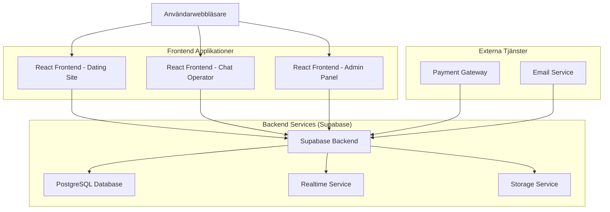
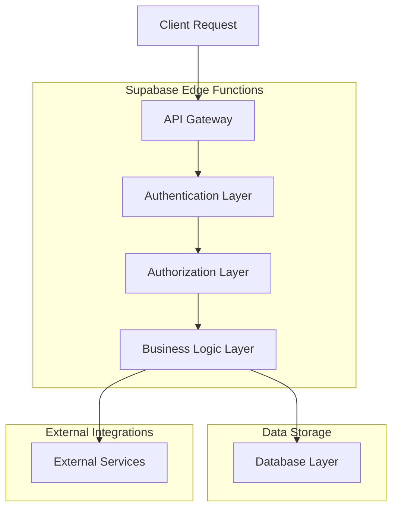
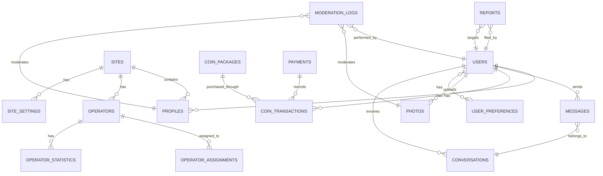

## 1. Arkitekturdesign



## 2. Teknologibeskrivning

**Frontend:**
- React@18 + TypeScript
- TailwindCSS@3 för styling
- Vite för byggverktyg
- Socket.io-client för realtidskommunikation
- React Router för navigation
- React Hook Form för formulärhantering
- React Query för datahantering

**Backend:**
- Supabase (Backend-as-a-Service)
- PostgreSQL databas
- Realtime-prenumerationer
- Row Level Security (RLS)
- Edge Functions för serverlös funktionalitet

**Externa tjänster:**
- Stripe för betalningar
- SendGrid för e-post
- Cloudinary för bildoptimering (valfritt)

## 3. Ruttdefinitioner

### Dating Site (Domän 1)
| Rutt | Syfte |
|------|--------|
| / | Startsida med bakgrundsbild och CTA |
| /register | Användarregistrering |
| /login | Användarinloggning |
| /profile/:id | Användarprofilvisning |
| /search | Profilsökning med filter |
| /chat | Chattgränssnitt med myntsaldo |
| /chat/:userId | Specifik chattkonversation |
| /purchase-coins | Myntköp och betalning |
| /settings | Användarinställningar |
| /hidden-admin | Dold admin-åtkomst på dating site |

### Chat Operator Panel (Domän 2)
| Rutt | Syfte |
|------|--------|
| /operator/dashboard | Operatörsöversikt och statistik |
| /operator/chat | Huvudsakligt chattgränssnitt |
| /operator/chat/:userId | Specifik användarchatt |
| /operator/users | Lista över alla användare |
| /operator/statistics | Detaljerad statistik och rapporter |
| /operator/profile | Operatörsprofil och inställningar |

### Admin Panel (Domän 3)
| Rutt | Syfte |
|------|--------|
| /admin/dashboard | Huvudadminpanel med översikt |
| /admin/sites | Hantering av dejtingsajter |
| /admin/sites/:siteId | Redigering av specifik sajt |
| /admin/operators | Operatörshantering |
| /admin/users | Användarhantering och moderering |
| /admin/content | Innehållsmoderering |
| /admin/reports | Rapporter och analys |
| /admin/settings | Systeminställningar |
| /admin/finance | Ekonomi och transaktioner |

## 4. API-definitioner

### 4.1 Autentiserings-API

**Användarregistrering**
```
POST /api/auth/register
```

Request:
```json
{
  "email": "anvandare@example.com",
  "password": "sakertlosenord123",
  "name": "Anna Svensson",
  "gender": "female",
  "age": 28,
  "location": "Stockholm",
  "interests": ["musik", "resor", "matlagning"]
}
```

Response:
```json
{
  "user": {
    "id": "uuid-string",
    "email": "anvandare@example.com",
    "name": "Anna Svensson"
  },
  "token": "jwt-token-string"
}
```

**Användarinloggning**
```
POST /api/auth/login
```

Request:
```json
{
  "email": "anvandare@example.com",
  "password": "sakertlosenord123"
}
```

### 4.2 Profil-API

**Hämta användarprofil**
```
GET /api/profile/:userId
```

Response:
```json
{
  "id": "uuid-string",
  "name": "Anna Svensson",
  "age": 28,
  "gender": "female",
  "location": "Stockholm",
  "bio": "Hej! Jag älskar att resa och upptäcka nya platser...",
  "interests": ["musik", "resor", "matlagning"],
  "photos": [
    {
      "id": "photo-uuid",
      "url": "https://storage.supabase.co/photo1.jpg",
      "isPrimary": true
    }
  ],
  "onlineStatus": "online",
  "lastSeen": "2024-01-15T10:30:00Z"
}
```

**Uppdatera profil**
```
PUT /api/profile/:userId
```

### 4.3 Chatt-API

**Skicka meddelande**
```
POST /api/chat/send
```

Request:
```json
{
  "recipientId": "mottagar-uuid",
  "message": "Hej! Hur mår du idag?",
  "messageType": "text"
}
```

Response:
```json
{
  "messageId": "msg-uuid",
  "status": "sent",
  "coinsDeducted": 1,
  "remainingCoins": 45
}
```

**Hämta chattmeddelanden**
```
GET /api/chat/conversation/:userId
```

### 4.4 Mynt-API

**Köp mynt**
```
POST /api/coins/purchase
```

Request:
```json
{
  "packageId": "coin-package-50",
  "paymentMethod": "stripe",
  "amount": 99.00,
  "currency": "SEK"
}
```

**Kontrollera myntsaldo**
```
GET /api/coins/balance
```

### 4.5 Admin-API

**Skapa ny sajt**
```
POST /api/admin/sites
```

Request:
```json
{
  "name": "Svenska Singlar",
  "domain": "svenskasingle.example.com",
  "theme": "romantic",
  "primaryColor": "#DC143C",
  "backgroundImage": "https://storage.supabase.co/bg1.jpg",
  "isActive": true
}
```

**Tilldela operatör till sajt**
```
POST /api/admin/operators/assign
```

## 5. Serverarkitektur



## 6. Datamodell

### 6.1 Entitetsrelationer



### 6.2 DDL-definitioner

**Användartabell (users)**
```sql
CREATE TABLE users (
    id UUID PRIMARY KEY DEFAULT gen_random_uuid(),
    email VARCHAR(255) UNIQUE NOT NULL,
    password_hash VARCHAR(255) NOT NULL,
    role VARCHAR(20) DEFAULT 'user' CHECK (role IN ('user', 'operator', 'admin')),
    is_verified BOOLEAN DEFAULT false,
    is_active BOOLEAN DEFAULT true,
    created_at TIMESTAMP WITH TIME ZONE DEFAULT NOW(),
    updated_at TIMESTAMP WITH TIME ZONE DEFAULT NOW()
);

CREATE INDEX idx_users_email ON users(email);
CREATE INDEX idx_users_role ON users(role);
```

**Profiltabell (profiles)**
```sql
CREATE TABLE profiles (
    id UUID PRIMARY KEY DEFAULT gen_random_uuid(),
    user_id UUID REFERENCES users(id) ON DELETE CASCADE,
    site_id UUID REFERENCES sites(id) ON DELETE CASCADE,
    name VARCHAR(100) NOT NULL,
    age INTEGER CHECK (age >= 18 AND age <= 100),
    gender VARCHAR(20) CHECK (gender IN ('male', 'female', 'other')),
    location VARCHAR(255),
    bio TEXT,
    interests JSONB,
    online_status VARCHAR(20) DEFAULT 'offline',
    last_seen TIMESTAMP WITH TIME ZONE,
    is_profile_complete BOOLEAN DEFAULT false,
    created_at TIMESTAMP WITH TIME ZONE DEFAULT NOW(),
    updated_at TIMESTAMP WITH TIME ZONE DEFAULT NOW()
);

CREATE INDEX idx_profiles_user_id ON profiles(user_id);
CREATE INDEX idx_profiles_site_id ON profiles(site_id);
CREATE INDEX idx_profiles_online_status ON profiles(online_status);
```

**Sajttabell (sites)**
```sql
CREATE TABLE sites (
    id UUID PRIMARY KEY DEFAULT gen_random_uuid(),
    name VARCHAR(255) NOT NULL,
    domain VARCHAR(255) UNIQUE NOT NULL,
    theme VARCHAR(50) DEFAULT 'default',
    primary_color VARCHAR(7),
    secondary_color VARCHAR(7),
    background_image_url TEXT,
    logo_url TEXT,
    description TEXT,
    is_active BOOLEAN DEFAULT true,
    settings JSONB,
    created_at TIMESTAMP WITH TIME ZONE DEFAULT NOW(),
    updated_at TIMESTAMP WITH TIME ZONE DEFAULT NOW()
);

CREATE INDEX idx_sites_domain ON sites(domain);
CREATE INDEX idx_sites_active ON sites(is_active);
```

**Meddelandetabell (messages)**
```sql
CREATE TABLE messages (
    id UUID PRIMARY KEY DEFAULT gen_random_uuid(),
    conversation_id UUID REFERENCES conversations(id) ON DELETE CASCADE,
    sender_id UUID REFERENCES users(id) ON DELETE CASCADE,
    recipient_id UUID REFERENCES users(id) ON DELETE CASCADE,
    content TEXT NOT NULL,
    message_type VARCHAR(20) DEFAULT 'text' CHECK (message_type IN ('text', 'image', 'emoji')),
    is_read BOOLEAN DEFAULT false,
    coins_cost INTEGER DEFAULT 1,
    created_at TIMESTAMP WITH TIME ZONE DEFAULT NOW()
);

CREATE INDEX idx_messages_conversation ON messages(conversation_id);
CREATE INDEX idx_messages_sender ON messages(sender_id);
CREATE INDEX idx_messages_recipient ON messages(recipient_id);
CREATE INDEX idx_messages_created ON messages(created_at DESC);
```

**Konversationstabell (conversations)**
```sql
CREATE TABLE conversations (
    id UUID PRIMARY KEY DEFAULT gen_random_uuid(),
    user1_id UUID REFERENCES users(id) ON DELETE CASCADE,
    user2_id UUID REFERENCES users(id) ON DELETE CASCADE,
    site_id UUID REFERENCES sites(id) ON DELETE CASCADE,
    last_message_at TIMESTAMP WITH TIME ZONE DEFAULT NOW(),
    is_active BOOLEAN DEFAULT true,
    created_at TIMESTAMP WITH TIME ZONE DEFAULT NOW()
);

CREATE INDEX idx_conversations_user1 ON conversations(user1_id);
CREATE INDEX idx_conversations_user2 ON conversations(user2_id);
CREATE INDEX idx_conversations_site ON conversations(site_id);
```

**Mynttransaktioner (coin_transactions)**
```sql
CREATE TABLE coin_transactions (
    id UUID PRIMARY KEY DEFAULT gen_random_uuid(),
    user_id UUID REFERENCES users(id) ON DELETE CASCADE,
    transaction_type VARCHAR(20) CHECK (transaction_type IN ('purchase', 'spend', 'refund', 'bonus')),
    amount INTEGER NOT NULL,
    coins_balance_after INTEGER NOT NULL,
    related_message_id UUID REFERENCES messages(id),
    payment_id UUID REFERENCES payments(id),
    description TEXT,
    created_at TIMESTAMP WITH TIME ZONE DEFAULT NOW()
);

CREATE INDEX idx_coin_transactions_user ON coin_transactions(user_id);
CREATE INDEX idx_coin_transactions_type ON coin_transactions(transaction_type);
```

**Operatörstilldelningar (operator_assignments)**
```sql
CREATE TABLE operator_assignments (
    id UUID PRIMARY KEY DEFAULT gen_random_uuid(),
    operator_id UUID REFERENCES users(id) ON DELETE CASCADE,
    site_id UUID REFERENCES sites(id) ON DELETE CASCADE,
    is_active BOOLEAN DEFAULT true,
    max_concurrent_chats INTEGER DEFAULT 10,
    created_at TIMESTAMP WITH TIME ZONE DEFAULT NOW(),
    UNIQUE(operator_id, site_id)
);

CREATE INDEX idx_operator_assignments_operator ON operator_assignments(operator_id);
CREATE INDEX idx_operator_assignments_site ON operator_assignments(site_id);
```

**Fototabell (photos)**
```sql
CREATE TABLE photos (
    id UUID PRIMARY KEY DEFAULT gen_random_uuid(),
    user_id UUID REFERENCES users(id) ON DELETE CASCADE,
    profile_id UUID REFERENCES profiles(id) ON DELETE CASCADE,
    url TEXT NOT NULL,
    thumbnail_url TEXT,
    is_primary BOOLEAN DEFAULT false,
    is_approved BOOLEAN DEFAULT false,
    moderation_status VARCHAR(20) DEFAULT 'pending' CHECK (moderation_status IN ('pending', 'approved', 'rejected')),
    rejection_reason TEXT,
    uploaded_at TIMESTAMP WITH TIME ZONE DEFAULT NOW(),
    moderated_at TIMESTAMP WITH TIME ZONE,
    moderated_by UUID REFERENCES users(id)
);

CREATE INDEX idx_photos_user ON photos(user_id);
CREATE INDEX idx_photos_profile ON photos(profile_id);
CREATE INDEX idx_photos_moderation ON photos(moderation_status);
```

**Rapporttabell (reports)**
```sql
CREATE TABLE reports (
    id UUID PRIMARY KEY DEFAULT gen_random_uuid(),
    reporter_id UUID REFERENCES users(id) ON DELETE CASCADE,
    reported_user_id UUID REFERENCES users(id) ON DELETE CASCADE,
    site_id UUID REFERENCES sites(id) ON DELETE CASCADE,
    report_type VARCHAR(50) CHECK (report_type IN ('inappropriate_content', 'harassment', 'fake_profile', 'scam', 'other')),
    description TEXT,
    evidence_urls JSONB,
    status VARCHAR(20) DEFAULT 'pending' CHECK (status IN ('pending', 'investigating', 'resolved', 'dismissed')),
    resolved_by UUID REFERENCES users(id),
    resolution_note TEXT,
    created_at TIMESTAMP WITH TIME ZONE DEFAULT NOW(),
    resolved_at TIMESTAMP WITH TIME ZONE
);

CREATE INDEX idx_reports_reporter ON reports(reporter_id);
CREATE INDEX idx_reports_reported ON reports(reported_user_id);
CREATE INDEX idx_reports_status ON reports(status);
```

### 6.3 Behörigheter och RLS-policyer

**Grundläggande åtkomstbehörigheter:**
```sql
-- Ge läsåtkomst till anonym roll
GRANT SELECT ON sites TO anon;
GRANT SELECT ON profiles TO anon;
GRANT SELECT ON photos TO anon;

-- Ge full åtkomst till autentiserad roll
GRANT ALL PRIVILEGES ON ALL TABLES TO authenticated;
```

**Row Level Security (RLS) Policyer:**
```sql
-- Profil-RLS: Användare kan bara se profiler från sin sajt
CREATE POLICY "profiles_site_isolation" ON profiles
    FOR ALL
    USING (site_id = current_setting('app.current_site_id')::uuid);

-- Meddelande-RLS: Användare kan bara se sina egna meddelanden
CREATE POLICY "messages_user_isolation" ON messages
    FOR ALL
    USING (sender_id = auth.uid() OR recipient_id = auth.uid());

-- Mynttransaktion-RLS: Användare kan bara se sina egna transaktioner
CREATE POLICY "coin_transactions_user_isolation" ON coin_transactions
    FOR ALL
    USING (user_id = auth.uid());
```

## 7. Realtidskommunikation

### 7.1 Realtidsprenumerationer

**Chattmeddelanden i realtid:**
```javascript
// Prenumerera på nya meddelanden för en konversation
const subscription = supabase
  .channel('chat-room')
  .on('postgres_changes', 
    { event: 'INSERT', schema: 'public', table: 'messages', filter: `conversation_id=eq.${conversationId}` },
    payload => {
      console.log('Nytt meddelande:', payload.new);
      // Uppdatera UI med nytt meddelande
    }
  )
  .subscribe();
```

**Online-status i realtid:**
```javascript
// Uppdatera online-status
const updateOnlineStatus = async (userId, status) => {
  await supabase
    .from('profiles')
    .update({ online_status: status, last_seen: new Date().toISOString() })
    .eq('user_id', userId);
};
```

### 7.2 Socket.io Integration

**Server-sida (Edge Function):**
```javascript
// Edge function för chatt-hantering
export default async function handler(req, res) {
  if (req.method === 'POST') {
    const { senderId, recipientId, message, conversationId } = req.body;
    
    // Spara meddelande i databas
    const { data, error } = await supabase
      .from('messages')
      .insert({
        sender_id: senderId,
        recipient_id: recipientId,
        conversation_id: conversationId,
        content: message,
        created_at: new Date().toISOString()
      })
      .select()
      .single();
    
    // Skicka realtidsuppdatering
    if (!error) {
      await supabase.channel('chat').send({
        type: 'broadcast',
        event: 'new-message',
        payload: data
      });
    }
    
    res.status(200).json(data);
  }
}
```

## 8. Filuppladdning och Bildhantering

### 8.1 Bilduppladdning

**Client-side implementation:**
```javascript
// Ladda upp profilbild
const uploadProfilePhoto = async (file, userId) => {
  const fileName = `${userId}/${Date.now()}-${file.name}`;
  
  const { data, error } = await supabase.storage
    .from('profile-photos')
    .upload(fileName, file, {
      cacheControl: '3600',
      upsert: false
    });
  
  if (error) throw error;
  
  // Spara bildreferens i databas
  const { data: photoData } = await supabase
    .from('photos')
    .insert({
      user_id: userId,
      url: data.path,
      is_primary: false,
      moderation_status: 'pending'
    });
  
  return photoData;
};
```

### 8.2 Bildmoderering

**Automatisk bildkontroll (Edge Function):**
```javascript
// Edge function för bildmoderering
export default async function moderateImage(req, res) {
  const { photoId, imageUrl } = req.body;
  
  // Använd AI-tjänst för bildanalys (t.ex. Google Vision API)
  const analysisResult = await analyzeImage(imageUrl);
  
  if (analysisResult.isAppropriate) {
    await supabase
      .from('photos')
      .update({
        moderation_status: 'approved',
        moderated_at: new Date().toISOString()
      })
      .eq('id', photoId);
  } else {
    await supabase
      .from('photos')
      .update({
        moderation_status: 'rejected',
        rejection_reason: analysisResult.reason,
        moderated_at: new Date().toISOString()
      })
      .eq('id', photoId);
  }
  
  res.status(200).json({ status: 'moderated' });
}
```

## 9. Multi-sajt Hantering

### 9.1 Dynamisk sajt-konfiguration

```javascript
// Hämta sajt-konfiguration baserat på domän
const getSiteConfiguration = async (domain) => {
  const { data, error } = await supabase
    .from('sites')
    .select('*')
    .eq('domain', domain)
    .eq('is_active', true)
    .single();
  
  if (error || !data) {
    throw new Error('Site not found or inactive');
  }
  
  return data;
};
```

### 9.2 Temahantering

```javascript
// Tillämpa sajt-tema dynamiskt
const applySiteTheme = (siteConfig) => {
  document.documentElement.style.setProperty('--primary-color', siteConfig.primary_color);
  document.documentElement.style.setProperty('--secondary-color', siteConfig.secondary_color);
  
  if (siteConfig.background_image_url) {
    document.body.style.backgroundImage = `url(${siteConfig.background_image_url})`;
  }
  
  document.title = siteConfig.name;
};
```

## 10. Mynt- och Betalningssystem

### 10.1 Myntförbrukning

```javascript
// Beräkna myntkostnad för meddelande
const calculateMessageCost = (messageLength, userType) => {
  const baseCost = 1; // 1 mynt per meddelande
  const lengthMultiplier = Math.ceil(messageLength / 500); // Extra kostnad för långa meddelanden
  const userMultiplier = userType === 'premium' ? 0.5 : 1; // Rabatt för premium-användare
  
  return Math.max(1, baseCost * lengthMultiplier * userMultiplier);
};
```

### 10.2 Betalningsintegration

**Stripe-betalning:**
```javascript
// Skapa betalningssession
const createPaymentSession = async (coinPackage, userId) => {
  const { data: session } = await supabase.functions.invoke('create-stripe-session', {
    body: {
      coinPackageId: coinPackage.id,
      userId: userId,
      successUrl: `${window.location.origin}/payment-success`,
      cancelUrl: `${window.location.origin}/payment-cancel`
    }
  });
  
  return session;
};
```

### 10.3 Transaktionslogg

```javascript
// Logga mynttransaktion
const logCoinTransaction = async (userId, type, amount, description) => {
  const { data: currentBalance } = await supabase
    .from('coin_transactions')
    .select('coins_balance_after')
    .eq('user_id', userId)
    .order('created_at', { ascending: false })
    .limit(1)
    .single();
  
  const newBalance = (currentBalance?.coins_balance_after || 0) + amount;
  
  await supabase.from('coin_transactions').insert({
    user_id: userId,
    transaction_type: type,
    amount: amount,
    coins_balance_after: newBalance,
    description: description,
    created_at: new Date().toISOString()
  });
  
  return newBalance;
};
```

## 11. Säkerhet och Prestanda

### 11.1 Säkerhetsåtgärder

- **JWT-autentisering** med refresh tokens
- **Rate limiting** för API-anrop
- **Input validering** och sanitering
- **SQL-injektionsskydd** genom Supabase RLS
- **XSS-skydd** med React's inbyggda skydd
- **HTTPS** obligatoriskt för alla anrop
- **CORS** konfigurerad per domän

### 11.2 Prestandaoptimering

- **Bildoptimering** med WebP-format
- **Lazy loading** för bilder och komponenter
- **Caching** med React Query
- **CDN** för statiska tillgångar
- **Database indexing** för snabba sökningar
- **Pagination** för stora datamängder
- **Debouncing** för sökinmatning

### 11.3 Övervakning

- **Error tracking** med Sentry
- **Performance monitoring** med Web Vitals
- **Analytics** med Google Analytics eller motsvarande
- **Uptime monitoring** för alla tjänster
- **Real-time alerts** för kritiska fel